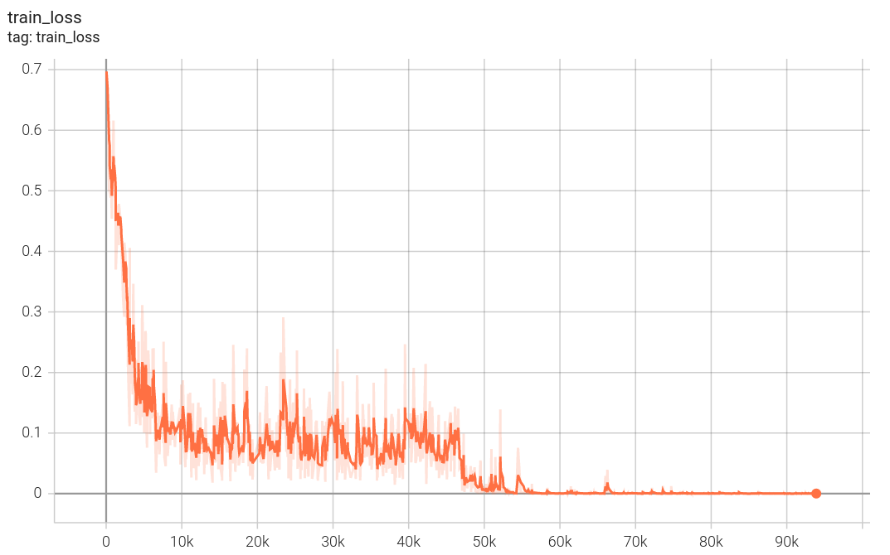
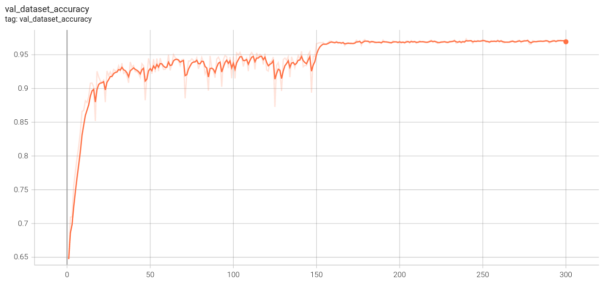
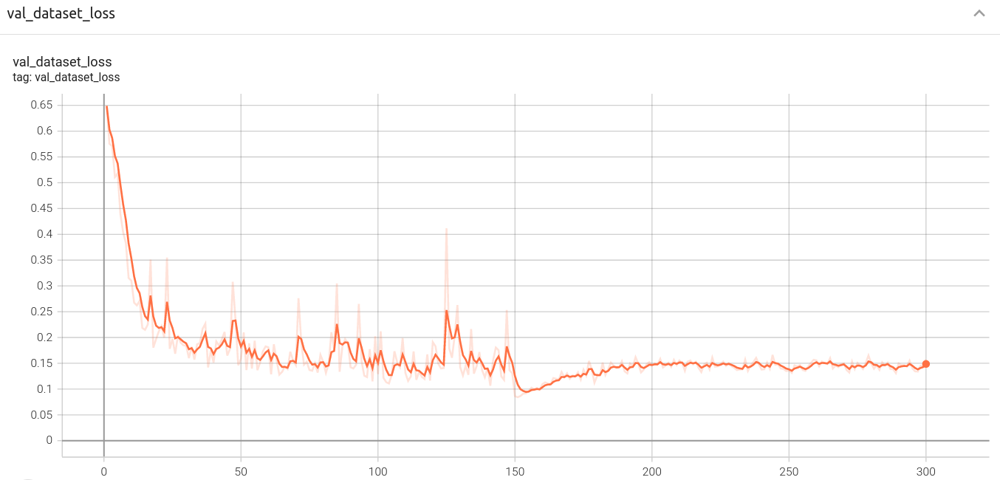

# 论文地址
https://arxiv.org/abs/1704.04861

# 运行环境
pytorch:1.10.0

# 数据集准备
下载猫狗分类数据集，放在dogvscat文件夹下。

下载链接：https://www.kaggle.com/competitions/dogs-vs-cats-redux-kernels-edition/data?select=sample_submission.csv

# 划分训练集验证集
```bash
python split_train_val.py
```

# 训练
```bash
python train.py
```

# 训练过程可视化
```bash
tensorboard --logdir='work_dir/runs'
```

# 产生提交结果
```bash
python generate_test_output.py
```
此模型产生的结果提交比赛端所得成绩十分奇怪，我也不知道为什么

# 训练结果可视化
```bash
python visual_result.py
```

# 训练过程



